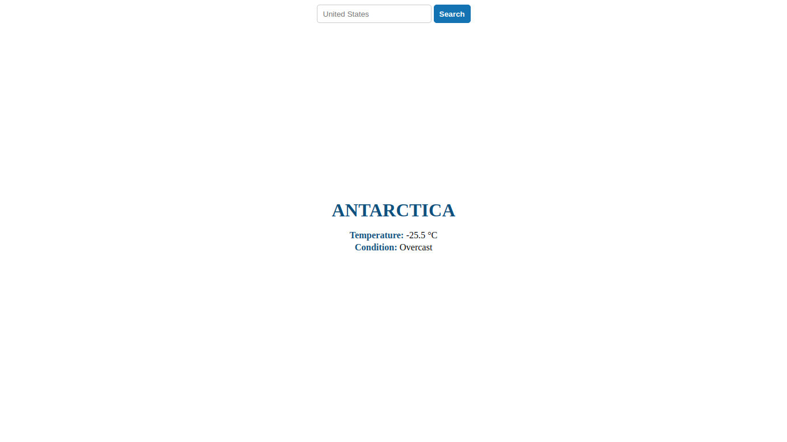

<a id="readme-top"></a>

<!-- PROJECT LOGO -->
<br />
<div align="center">
  <a href="https://github.com/raphash/odin-todolist">
    
  </a>

  <h3 align="center">Odin - Weather App.</h3>
</div>

<!-- TABLE OF CONTENTS -->
<details>
  <summary>Table of Contents</summary>
  <ol>
    <li>
      <a href="#about-the-project">About The Project</a>
      <ul>
        <li><a href="#built-with">Built With</a></li>
      </ul>
    </li>
    <li>
      <a href="#getting-started">Getting Started</a>
      <ul>
        <li><a href="#installation">Installation</a></li>
      </ul>
    </li>
    <li><a href="#usage">Usage</a></li>
    <li><a href="#license">License</a></li>
    <li><a href="#acknowledgments">Acknowledgments</a></li>
  </ol>
</details>

<!-- ABOUT THE PROJECT -->

## About The Project

<p style="width: 50rem">
  This project is a simple Weather App application with a simple interface, created for study and practice purposes. 
  The app allows users to search a location and fetch it temperature in celsius.
</p>

<p align="left">(<a href="#readme-top">back to top</a>)</p>

### Project Preview



<p align="left">(<a href="#readme-top">back to top</a>)</p>

### Built With

- [](#)
- [](#)
- [](#)
- [](#)

<p align="left">(<a href="#readme-top">back to top</a>)</p>

<!-- GETTING STARTED -->

## Getting Started

This is the instructions on setting up your project locally.
To get a local copy up and running follow these simplesteps.

### Installation

1. Clone the repo

   ```sh
   git clone https://github.com/raphash/odin-weather-app.git
   ```

2. Install NPM packages

   ```sh
   npm install
   ```

3. Build this project

   ```sh
   npm run build
   ```

<p align="left">(<a href="#readme-top">back to top</a>)</p>

<!-- USAGE EXAMPLES -->

## Usage

1. Open Development Server

   ```sh
     npm run start
   ```

<p align="left">(<a href="#readme-top">back to top</a>)</p>

<!-- LICENSE -->

## License

Distributed under the MIT License. See `LICENSE.txt` for more information.

<p align="left">(<a href="#readme-top">back to top</a>)</p>

<!-- ACKNOWLEDGMENTS -->

## Acknowledgments

- [Boxicons](https://boxicons.com/)
- [Visual Crossing Weather Api](https://www.visualcrossing.com/weather-api)

<p align="left">(<a href="#readme-top">back to top</a>)</p>
